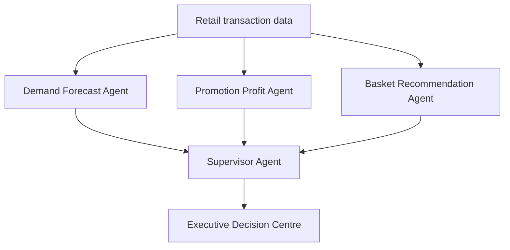

# RetailGrowth AI

RetailGrowth AI is a multi-agent machine-learning platform designed to identify opportunities for increasing retail sales and profit.

The system combines demand forecasting, promotion optimisation and market-basket analysis. A Supervisor Agent reviews the specialist outputs and creates a prioritised management decision queue.
[](https://github.com/ryogi222/retail-growth-ai/actions/workflows/tests.yml)

## Live Demo

[Open the RetailGrowth AI Dashboard](https://retailgrowth-ai-yogesh.streamlit.app)
 
This portfolio prototype uses synthetic retail data. It does not contain confidential Tesco or customer information.
## Dashboard Preview


## Business objectives

- Increase sales and gross profit
- Improve promotion effectiveness
- Identify profitable product bundles
- Predict future product demand
- Support store-level management decisions
- Maintain human review before implementation

## Multi-agent architecture



## Agents

### Demand Forecast Agent

Uses XGBoost, calendar variables, lag features and rolling sales statistics to predict daily product demand.

### Promotion Profit Agent

Tests multiple discount levels and recommends the option with the highest expected profit.

### Basket Recommendation Agent

Uses Apriori association rules to identify products frequently purchased together.

### Supervisor Agent

Combines outputs from the specialist agents and assigns high, medium or low management priority.

All decisions remain `Pending Manager Review`.

## Application features

- Revenue, profit and margin dashboard
- Store and category filters
- Actual versus predicted demand
- Promotion-profit recommendations
- Product-bundle recommendations
- Prioritised executive decisions
- Downloadable management decision report
- Automated pipeline logging
- Automated data, model and governance tests

## Baseline business results

| KPI | Result |
|---|---:|
| Revenue | £292,511 |
| Profit | £119,159 |
| Profit margin | 40.7% |
| Average basket value | £11.70 |
| Transactions | 25,000 |
| Automated tests | 12 passed |

These values were generated from synthetic demonstration data and do not represent actual Tesco performance.

## Technology

- Python
- Pandas and NumPy
- Scikit-learn
- XGBoost
- MLxtend
- Streamlit
- Plotly and Matplotlib
- Joblib
- Pytest

## Project structure

```text
retail-growth-ai/
├── agents/
│   ├── basket_recommendation_agent.py
│   ├── demand_forecast_agent.py
│   ├── promotion_profit_agent.py
│   └── supervisor_agent.py
├── data/
│   └── generate_retail_data.py
├── notebooks/
│   ├── 01_data_validation.py
│   └── 02_exploratory_analysis.py
├── pages/
│   └── 1_Executive_Decisions.py
├── tests/
│   └── test_project.py
├── app.py
├── run_pipeline.py
├── requirements.txt
└── README.md
```

## Local installation

Clone the repository and enter the project:

```bash
git clone YOUR_REPOSITORY_URL
cd retail-growth-ai
```

Create a virtual environment:

```bash
python -m venv .venv
```

Activate it on Windows:

```powershell
.venv\Scripts\Activate.ps1
```

Install the packages:

```bash
python -m pip install -r requirements.txt
```

## Generate demonstration data

```bash
python data/generate_retail_data.py
```

## Run the complete AI pipeline

```bash
python run_pipeline.py
```

Expected result:

```text
Status: SUCCESS
Completed steps: 6/6
```

## Run automated tests

```bash
pytest -v
```

Expected result:

```text
12 passed
```

## Start the dashboard

```bash
streamlit run app.py
```

Open:

```text
http://localhost:8501
```

## Responsible AI and governance

- Only synthetic data is included in the public project.
- Customer identifiers are artificial.
- Recommendations are decision support, not automatic decisions.
- Promotion recommendations require margin checks.
- Managers must approve actions before implementation.
- Real deployment would require security, privacy, bias, drift and controlled-pilot testing.

## Future development

- Connect authorised real-time sales and stock data
- Add weather, events and holiday features
- Introduce causal promotion-uplift modelling
- Add model monitoring and drift alerts
- Run controlled A/B testing
- Deploy through an approved cloud environment
- Add role-based access control

## Author

**Yogeshwaran Doresamy**

MSc Data Science graduate with retail operations, business management, machine learning and software testing experience.
